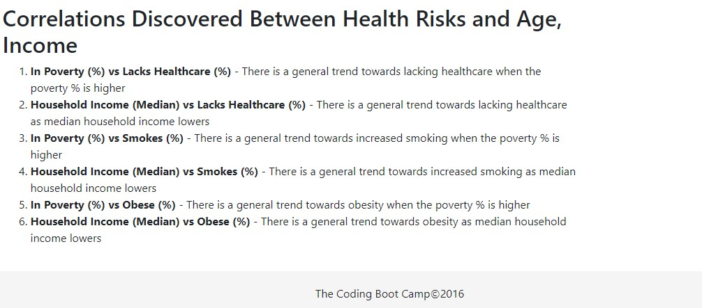

# Data Journalism

- **_Health Risk Demographics_** - Is based off 2014 ACS 1-year estimates from the [US Census Bureau](https://data.census.gov/cedsci/) and explores health risks that face certain demographics.

## Files

- [`D3_data_journalism/index.html`](D3_data_journalism/index.html) - Index page that has the base html to place the chart and demographic selections

- [`D3_data_journalism/assets/js/app.js`](D3_data_journalism/assets/js/app.js) - The primary application code file, it contains the code to initialize the chart and demographic elements and then capture events to update the page based upon the demographics clicked in the chart label

- [`D3_data_journalism/assets/data/data.csv`](D3_data_journalism/assets/data/data.csv) - The source data set for Health Risk Demographics

## Results

## Execution

1. To view the interactive dashboard page `Cntrl + Click` [here](https://jayhjman.github.io/D3-Challenge/D3_data_journalism/) to open in another tab

## Author

Made by [Jay](https://www.linkedin.com/in/jay-hastings-techy/) with :heart: in 2021
